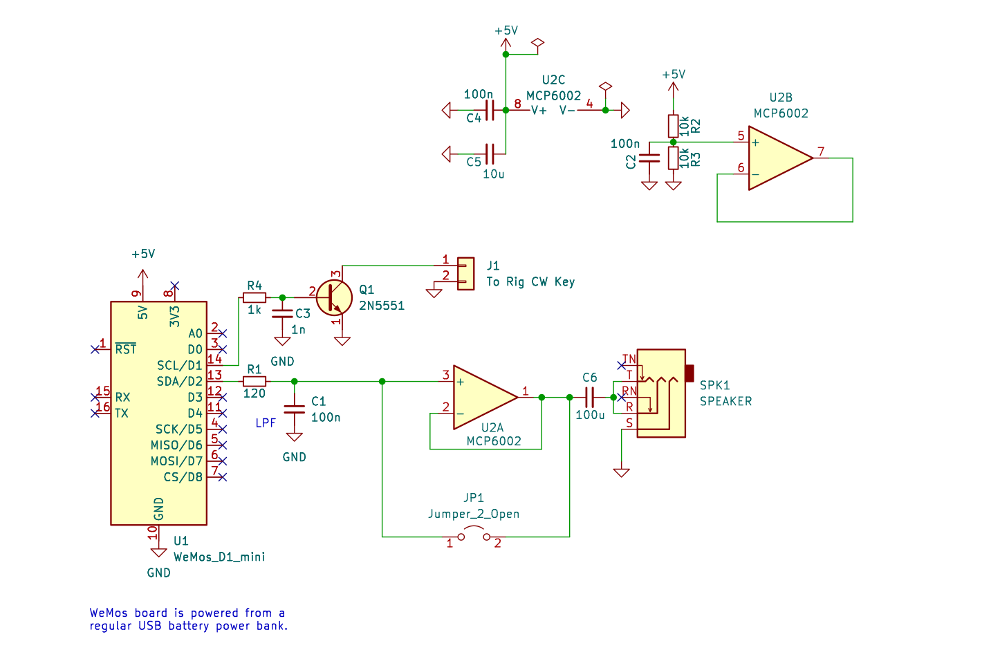

# Info

An easy portable WiFi CW keyer powered by `Wemos D1 Mini` MCU board.

This project is based on the https://github.com/vu3ave/wifi-cw-keyboard work.

## Setup

[Windows Users] Run `setup_arduino_ide.bat` - perhaps within `Administrator`
privileges.

Follow [this tutorial first](https://desertbot.io/blog/d1-mini-blink-windows) to
blink a LED on a WeMos D1 Mini board.

Follow [this tutorial second](https://randomnerdtutorials.com/esp8266-web-server-spiffs-nodemcu/)
to get familiar with SPIFFS uploading stuff. Use the `Tools -> ESP8266 Sketch
Data Upload` option in the Arduino IDE to upload the webserver resources to
ESP8266.

Open and upload the sketch from the `code` folder to the ESP8266 using the
`Sketch -> Upload` option in the Arduino IDE.

## Usage

After uploading the sketch, ESP8266 will start AP Mode and create a WiFi
hotspot named `192.168.4.1`.

Join this WiFi network using a computer or phone.

Now open the browswer (Chrome / Firefox) and navigate to http://192.168.4.1
URL.

A web page opens where you can type in messages in english. These messages are
translated to CW (telegraphy messages) and sent out as digital pulses on Pin 5
(GPIO5).

## Sample Circuit

## References

- https://github.com/vu3ave/wifi-cw-keyboard
